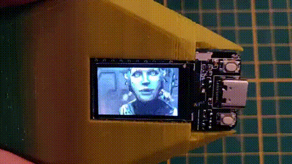

# Esp32 TFT Animation tester

ESP32 project tha use [esp32-etft-gif-converter](https://github.com/alex-arce/esp32-etft-gif-converter) @alex-arce for run a animation test on a TTGO T-Display board.

# Compiling and Installing

You could be use PlatformIO or Arduino for build this sample.
